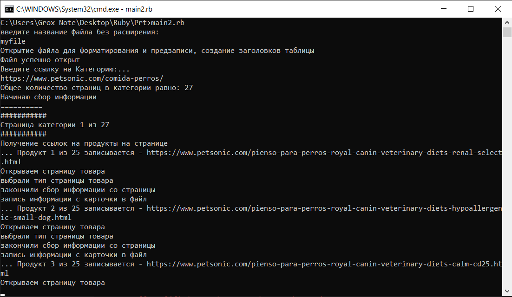
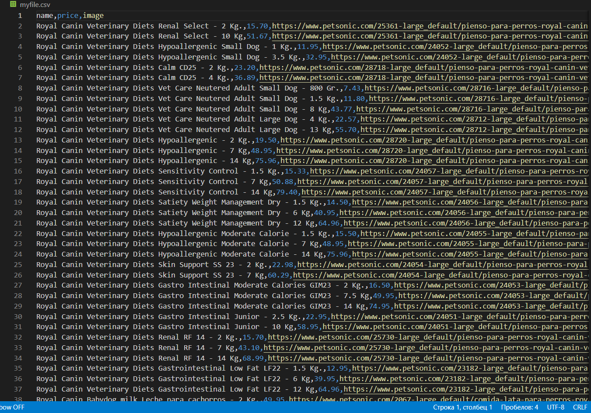

# Pr_rby
В качестве самообучения написал парсер для сайта petsonic.com/
Необходимо было собрать в единый файл все товары из указанной категории, а также все вариции товаров.

Страниц в категории может быть несколько, нужно пройти по всем.

================

К примеру, возьмем следующую категорию: https://www.petsonic.com/comida-perros/

Получаем следующие записи в csv:

То есть записывается информация в файл следующим образом:
Name + weight; price; img